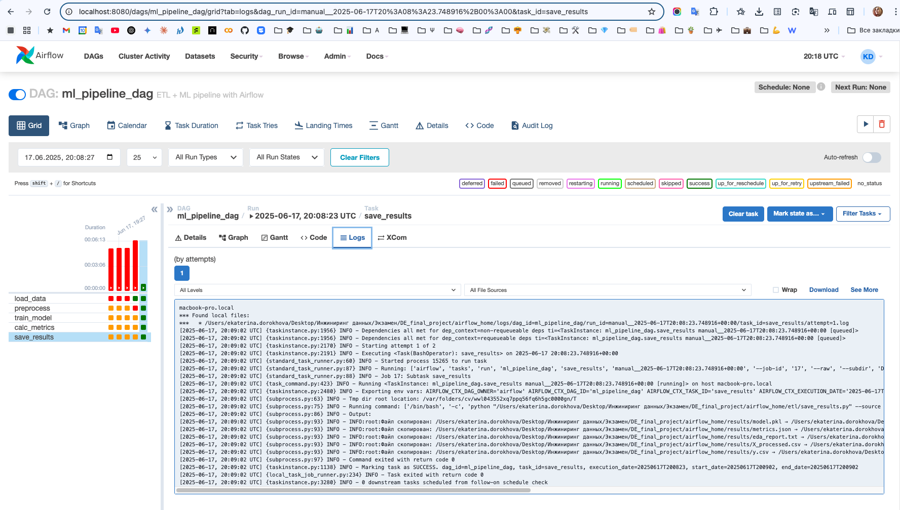
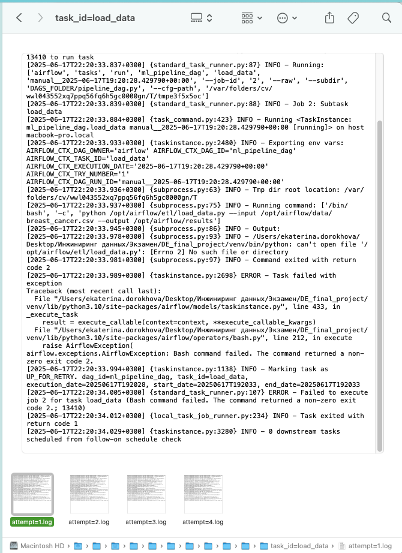

# Инжиниринг данных. Автоматизация и оркестрация пайплайна машинного обучения с использованием Apache Airflow и облачного хранилища.

**Описание проекта**

Цель проекта — построить полный ETL-процесс и обучить модель машинного обучения на датасете breast_cancer.csv, автоматизировав все этапы с помощью Apache Airflow. Результат - устойчивая система, в которой реализован контроль версий, повторяемость и возможность масштабирования.

**Структура проекта**

```
project/
│
├── data/
│   └── breast_cancer.csv # Исходные данные
│
├── etl/
│   ├── load_data.py # Загрузка и EDA
│   ├── preprocess.py # Очистка и масштабирование
│   ├── train_model.py # Обучение модели
│   ├── metrics.py # Расчёт метрик
│   └── save_results.py # Финальная упаковка
│
├── results/
│   ├── X_processed.csv
│   ├── y.csv
│   ├── model.pkl
│   ├── metrics.json
│   ├── eda_report.txt
│   └── final/ # Финальные артефакты
│
├── dags/
│   └── pipeline_dag.py # DAG-файл Airflow
│
└── README.md # Описание проекта
```

**Используемые технологии**

- Python 3.10+
- Apache Airflow
- pandas, scikit-learn, joblib
- bash + argparse
- JSON / CSV / PKL

**Этапы пайплайна**

1. Загрузка (load_data.py) - чтение CSV, сохранение копии и генерация отчёта.
2. Предобработка (preprocess.py) - очистка, кодирование меток, стандартизация.
3. Обучение (train_model.py) - деление на выборки, обучение логистической регрессии, сохранение в pkl.
4. Метрики (metrics.py) - предсказания и расчёт метрик (accuracy, F1).
5. Финализация (save_results.py) - упаковка всех результатов в results/final/.

**DAG-файл: (pipeline_dag.py)**

Настроен в Airflow на выполнение по требованию (schedule: `None`). Включает 5 связанных задач одна за другой.

```bash
airflow dags trigger ml_pipeline_dag
```

**Метрики модели**

Пример содержимого metrics.json:

```json
{
    "accuracy": 0.95,
    "precision": 0.96,
    "recall": 0.93,
    "f1_score": 0.94
}
```

---
## Этап 1. Разработка ETL-компонентов

### Скрипт 1 - загрузка и первичный анализ данных (load_data.py)

**Работа скрипта:**
- Загрузка CSV-файла с данными (Breast Cancer Wisconsin Diagnostic),
- Выполнение базового EDA и написание отчёт в results/eda_report.txt (размер, пропущенные значения, типы колонок),
- Сохранение EDA-отчёта и копии исходного датасета в CSV в results/raw_data.csv.

**Структура**
- Аргументы через argparse
- Минимальный логгинг (print() или logging)
- Обработка ошибок
- Воспроизводимость

**Код etl/load_data.py**

```python
import pandas as pd
import os
import argparse
import logging

# Названия колонок взяты из официального описания датасета (https://archive.ics.uci.edu/ml/datasets/Breast+Cancer+Wisconsin+(Diagnostic))
column_names = [
    'id', 'diagnosis',
    'radius_mean', 'texture_mean', 'perimeter_mean', 'area_mean', 'smoothness_mean',
    'compactness_mean', 'concavity_mean', 'concave_points_mean', 'symmetry_mean', 'fractal_dimension_mean',
    'radius_se', 'texture_se', 'perimeter_se', 'area_se', 'smoothness_se',
    'compactness_se', 'concavity_se', 'concave_points_se', 'symmetry_se', 'fractal_dimension_se',
    'radius_worst', 'texture_worst', 'perimeter_worst', 'area_worst', 'smoothness_worst',
    'compactness_worst', 'concavity_worst', 'concave_points_worst', 'symmetry_worst', 'fractal_dimension_worst'
]

def load_csv(file_path):
    try:
        df = pd.read_csv(file_path, header=None, names=column_names)
        logging.info(f"Датасет загружен: {file_path}")
        return df
    except Exception as e:
        logging.error(f"Ошибка при загрузке CSV: {e}")
        raise

def basic_eda(df, output_dir):
    os.makedirs(output_dir, exist_ok=True)
    shape_info = f"Размерность: {df.shape}"
    nulls_info = df.isnull().sum().to_string()
    dtypes_info = df.dtypes.to_string()

    report = "\n".join([shape_info, "\nПропуски:\n", nulls_info, "\nТипы данных:\n", dtypes_info])

    report_path = os.path.join(output_dir, "eda_report.txt")
    with open(report_path, "w") as f:
        f.write(report)
    
    logging.info(f"EDA-отчёт сохранён в: {report_path}")
    return report_path

def save_copy(df, output_dir):
    os.makedirs(output_dir, exist_ok=True)
    output_path = os.path.join(output_dir, "raw_data.csv")
    df.to_csv(output_path, index=False)
    logging.info(f"Копия датасета сохранена в: {output_path}")
    return output_path

if __name__ == "__main__":
    parser = argparse.ArgumentParser(description="Load CSV and perform basic EDA")
    parser.add_argument("--input", required=True, help="Путь к CSV-файлу")
    parser.add_argument("--output", default="results", help="Папка для вывода отчёта")

    args = parser.parse_args()

    logging.basicConfig(level=logging.INFO)

    df = load_csv(args.input)
    basic_eda(df, args.output)
    save_copy(df, args.output)
```

**Запуск (вручную)**

```bash
python etl/load_data.py --input data/breast_cancer.csv --output results/
```

---
## Этап 2. Предобработка данных

### Скрипт 2 - очистка и нормализация признаков (preprocess.py)

**Работа скрипта:**

1. Загрузка (raw_data.csv) - используются результат предыдущего шага
2. Очистка, удаление id, обработка пропусков
3. Преобразование категориальной переменной diagnosis в число (кодирование M в 1, B в 0)
4. Масштабирование числовых признаков (StandardScaler)
5. Сохранение предобработанных X (X_processed.csv) и y (y.csv) в папку results/.

**Код etl/preprocess.py**

```python
import pandas as pd
import numpy as np
import argparse
import os
import logging
from sklearn.preprocessing import StandardScaler

def preprocess(input_file, output_dir):
    os.makedirs(output_dir, exist_ok=True)
    df = pd.read_csv(input_file)

    # Удаление неинформативного столбца
    if 'id' in df.columns:
        df = df.drop(columns=['id'])

    # Преобразование целевой переменной
    df['diagnosis'] = df['diagnosis'].map({'M': 1, 'B': 0})

    # Делим на X и y
    y = df['diagnosis']
    X = df.drop(columns=['diagnosis'])

    # Масштабирование признаков
    scaler = StandardScaler()
    X_scaled = scaler.fit_transform(X)
    X_scaled_df = pd.DataFrame(X_scaled, columns=X.columns)

    # Сохранение результатов
    x_path = os.path.join(output_dir, "X_processed.csv")
    y_path = os.path.join(output_dir, "y.csv")
    X_scaled_df.to_csv(x_path, index=False)
    y.to_csv(y_path, index=False)

    logging.info(f"Файлы сохранены: {x_path}, {y_path}")

if __name__ == "__main__":
    parser = argparse.ArgumentParser(description="Предобработка данных: очистка и масштабирование")
    parser.add_argument("--input", required=True, help="Путь к исходному CSV")
    parser.add_argument("--output", default="results", help="Путь для вывода")

    args = parser.parse_args()
    logging.basicConfig(level=logging.INFO)

    preprocess(args.input, args.output)
```

**Запуск (вручную)**

```bash
python etl/preprocess.py --input results/raw_data.csv --output results/
```

**Результат:**

- `results/X_processed.csv` — признаки после масштабирования,
- `results/y.csv` — целевая переменная числом.

---
## Этап 3. Обучение

### Скрипт 3 - (train_model.py)

**Работа скрипта:**


**Код etl/train_model.py**

```python
import pandas as pd
import argparse
import os
import logging
import joblib
from sklearn.model_selection import train_test_split
from sklearn.linear_model import LogisticRegression

def train_model(x_path, y_path, output_dir):
    os.makedirs(output_dir, exist_ok=True)

    # Загрузка данных
    X = pd.read_csv(x_path)
    y = pd.read_csv(y_path).squeeze()  # y — Series

    # Разделение на обучающую и тестовую выборки
    X_train, X_test, y_train, y_test = train_test_split(X, y, test_size=0.2, random_state=42)

    # Обучение модели
    model = LogisticRegression(max_iter=1000)
    model.fit(X_train, y_train)

    # Сохранение модели
    model_path = os.path.join(output_dir, "model.pkl")
    joblib.dump(model, model_path)
    logging.info(f"Модель сохранена в: {model_path}")

if __name__ == "__main__":
    parser = argparse.ArgumentParser(description="Обучение модели логистической регрессии")
    parser.add_argument("--x", required=True, help="Путь к X_processed.csv")
    parser.add_argument("--y", required=True, help="Путь к y.csv")
    parser.add_argument("--output", default="results", help="Путь для сохранения модели")

    args = parser.parse_args()
    logging.basicConfig(level=logging.INFO)

    train_model(args.x, args.y, args.output)
```

**Запуск**


---
## Этап 4. Метрики

### Скрипт 4 - (metrics.py)

**Работа скрипта:**


**Код etl/metrics.py**

```python
import pandas as pd
import argparse
import os
import logging
import joblib
import json
from sklearn.metrics import accuracy_score, precision_score, recall_score, f1_score
from sklearn.model_selection import train_test_split

def evaluate_model(x_path, y_path, model_path, output_dir):
    os.makedirs(output_dir, exist_ok=True)

    # Загрузка данных
    X = pd.read_csv(x_path)
    y = pd.read_csv(y_path).squeeze()

    # Деление на train и test
    _, X_test, _, y_test = train_test_split(X, y, test_size=0.2, random_state=42)

    # Загрузка модели
    model = joblib.load(model_path)

    # Предсказания
    y_pred = model.predict(X_test)

    # Метрики
    metrics = {
        "accuracy": accuracy_score(y_test, y_pred),
        "precision": precision_score(y_test, y_pred),
        "recall": recall_score(y_test, y_pred),
        "f1_score": f1_score(y_test, y_pred)
    }

    # Сохранение в JSON
    metrics_path = os.path.join(output_dir, "metrics.json")
    with open(metrics_path, "w") as f:
        json.dump(metrics, f, indent=4)

    logging.info(f"Метрики сохранены в: {metrics_path}")
    return metrics

if __name__ == "__main__":
    parser = argparse.ArgumentParser(description="Оценка модели и сохранение метрик")
    parser.add_argument("--x", required=True, help="Путь к X_processed.csv")
    parser.add_argument("--y", required=True, help="Путь к y.csv")
    parser.add_argument("--model", required=True, help="Путь к model.pkl")
    parser.add_argument("--output", default="results", help="Папка для сохранения метрик")

    args = parser.parse_args()
    logging.basicConfig(level=logging.INFO)

    evaluate_model(args.x, args.y, args.model, args.output)
```

**Запуск**


---
## Этап 5. Сохранение результатов

### Скрипт 5 - (save_results.py)

**Работа скрипта:**


**Код etl/save_results.py**

```python
import os
import shutil
import argparse
import logging

def save_artifacts(source_dir, output_dir):
    os.makedirs(output_dir, exist_ok=True)

    files_to_copy = [
        "model.pkl",
        "metrics.json",
        "eda_report.txt",
        "X_processed.csv",
        "y.csv"
    ]

    for filename in files_to_copy:
        src = os.path.join(source_dir, filename)
        dst = os.path.join(output_dir, filename)

        if os.path.exists(src):
            shutil.copy(src, dst)
            logging.info(f"Файл скопирован: {src} → {dst}")
        else:
            logging.warning(f"Файл не найден и не будет скопирован: {src}")

if __name__ == "__main__":
    parser = argparse.ArgumentParser(description="Финальное сохранение артефактов пайплайна")
    parser.add_argument("--source", default="results", help="Папка с результатами предыдущих шагов")
    parser.add_argument("--output", default="results/final", help="Папка для финальной выгрузки")

    args = parser.parse_args()
    logging.basicConfig(level=logging.INFO)

    save_artifacts(args.source, args.output)
```

**Запуск**

---
## Этап 6. Оркестрация процесса

### Скрипт 6 - оркестрирация всех этапов ETL и ML-пайплайна (pipeline_dag.py)

**Работа скрипта:**

1. Загрузка данных и EDA
2. Предобработка
3. Обучение модели
4. Расчёт метрик
5. Финализация артефактов

**Код pipeline_dag.py**

```python
from airflow import DAG
from airflow.operators.bash import BashOperator
from datetime import datetime, timedelta

default_args = {
    'owner': 'airflow',
    'retries': 1,
    'retry_delay': timedelta(minutes=5)
}

with DAG(
    dag_id='ml_pipeline_dag',
    default_args=default_args,
    description='ETL + ML pipeline with Airflow',
    schedule_interval=None,
    start_date=datetime(2023, 1, 1),
    catchup=False
) as dag:

    load_data = BashOperator(
        task_id='load_data',
        bash_command='python "/Users/ekaterina.dorokhova/Desktop/Инжиниринг данных/Экзамен/DE_final_project/airflow_home/etl/load_data.py" '
                     '--input "/Users/ekaterina.dorokhova/Desktop/Инжиниринг данных/Экзамен/DE_final_project/airflow_home/data/breast_cancer.csv" '
                     '--output "/Users/ekaterina.dorokhova/Desktop/Инжиниринг данных/Экзамен/DE_final_project/airflow_home/results"'
    )

    preprocess = BashOperator(
        task_id='preprocess',
        bash_command='python "/Users/ekaterina.dorokhova/Desktop/Инжиниринг данных/Экзамен/DE_final_project/airflow_home/etl/preprocess.py" '
                     '--input "/Users/ekaterina.dorokhova/Desktop/Инжиниринг данных/Экзамен/DE_final_project/airflow_home/results/raw_data.csv" '
                     '--output "/Users/ekaterina.dorokhova/Desktop/Инжиниринг данных/Экзамен/DE_final_project/airflow_home/results"'
    )

    train_model = BashOperator(
        task_id='train_model',
        bash_command='python "/Users/ekaterina.dorokhova/Desktop/Инжиниринг данных/Экзамен/DE_final_project/airflow_home/etl/train_model.py" '
                     '--x "/Users/ekaterina.dorokhova/Desktop/Инжиниринг данных/Экзамен/DE_final_project/airflow_home/results/X_processed.csv" '
                     '--y "/Users/ekaterina.dorokhova/Desktop/Инжиниринг данных/Экзамен/DE_final_project/airflow_home/results/y.csv" '
                     '--output "/Users/ekaterina.dorokhova/Desktop/Инжиниринг данных/Экзамен/DE_final_project/airflow_home/results"'
    )

    calc_metrics = BashOperator(
        task_id='calc_metrics',
        bash_command='python "/Users/ekaterina.dorokhova/Desktop/Инжиниринг данных/Экзамен/DE_final_project/airflow_home/etl/metrics.py" '
                     '--x "/Users/ekaterina.dorokhova/Desktop/Инжиниринг данных/Экзамен/DE_final_project/airflow_home/results/X_processed.csv" '
                     '--y "/Users/ekaterina.dorokhova/Desktop/Инжиниринг данных/Экзамен/DE_final_project/airflow_home/results/y.csv" '
                     '--model "/Users/ekaterina.dorokhova/Desktop/Инжиниринг данных/Экзамен/DE_final_project/airflow_home/results/model.pkl" '
                     '--output "/Users/ekaterina.dorokhova/Desktop/Инжиниринг данных/Экзамен/DE_final_project/airflow_home/results"'
    )

    save_results = BashOperator(
        task_id='save_results',
        bash_command='python "/Users/ekaterina.dorokhova/Desktop/Инжиниринг данных/Экзамен/DE_final_project/airflow_home/etl/save_results.py" '
                     '--source "/Users/ekaterina.dorokhova/Desktop/Инжиниринг данных/Экзамен/DE_final_project/airflow_home/results" '
                     '--output "/Users/ekaterina.dorokhova/Desktop/Инжиниринг данных/Экзамен/DE_final_project/airflow_home/results/final"'
    )

    # Зависимости
    load_data >> preprocess >> train_model >> calc_metrics >> save_results
```

**Запуск**

---
## Подтверждение успешного запуска пайплайна

После завершения всех этапов и запуска DAG'а в Apache Airflow (`ml_pipeline_dag`) были получены следующие результаты:

**Все 5 задач выполнены успешно**:
1. load_data
2. preprocess
3. train_model
4. calc_metrics
5. save_results

**Файлы сгенерированые и сохранены:**
- results/eda_report.txt — отчёт по данным
- results/raw_data.csv — копия исходного датасета
- results/X_processed.csv и y.csv — предобработанные признаки и метки
- results/model.pkl — обученная модель
- results/metrics.json — метрики модели
- results/final/ — копии всех ключевых файлов для финальной упаковки

**Все артефакты находятся в results/final/:**
1. eda_report.txt
2. model.pkl
3. metrics.json
4. X_processed.csv
5. y.csv

**Скриншоты:**
**1. Скриншоты интерфейса DAG:**

Graph со статусами "success":


Лог задачи 1:


Лог задачи 2:


Лог задачи 3:


Лог задачи 4:


Лог задачи 5:


**2. Скриншоты папки results/final/:**


**3. Скриншоты папки logs/:**




---
## Возможные улучшения в будущем

- Добавить телеграм-уведомления в DAG,
- Сохранение артефактов в облако (Яндекс.Диск / Google Drive),
- Разделение train и test через Cross-Validation,
- Использование MLflow для логирования метрик,
- Миграция с BashOperator на PythonOperator.
